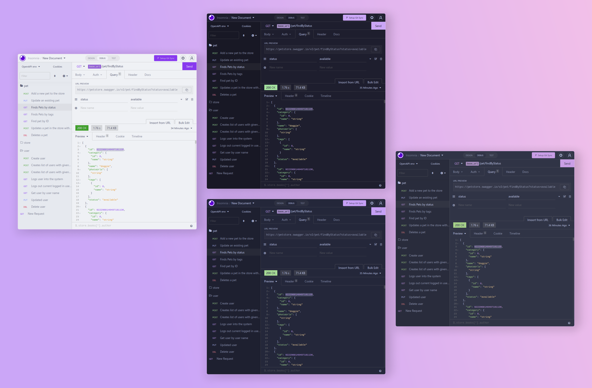

<h3 align="center">
	 
	
	Catppuccin for Insomnia
	
</h3>

    
    
    

## Usage

#### Install

1. In Insomnia, go to _Application_ and select _Preferences_
2. Click on _Plugins_
3. Paste `insomnia-plugin-theme-catppuccin` into the package name field
4. Click on _Install Plugin_

#### Activating theme

1. Go to _Application_ and select _Preferences_
2. Click on _Themes_
3. Select **Catppuccin** to apply the theme

## 💝 Thanks to

&nbsp;

Copyright &copy; 2021-present <a href="https://github.com/catppuccin" target="_blank">Catppuccin Org</a>

